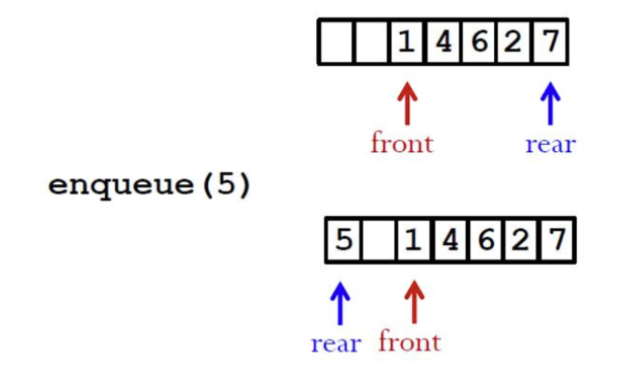

# VE280 Final RC

## Lecture 20: Container of Pointers, Polymorphic Containers

### Container of Pointers

**Motivation**: Still consider the templated linked list we define before. What if the template `class T` is itself a very large data type containing a very large memory. We do not want to directly make a list for those large things. However, what we want is to make a list for the addresses.

```cpp
//The "pointer" version of our templated linked list.
template <class T>
class List {
public:
    ...
    void insert(T *v);
    T *remove();
private:
    //Two dynamically allocated objects.
    struct node {
        node *next;
        T *o;
    };
    ....
};
```

This would be a great method to improve the efficiency of the program. However, we should be very careful about the memory. Always remember to delete the allocated memory.

### Three Rules and One Invariant

- **At-most-once Invariant**: For every dynamically allocated object, there is at most one container that owns it at any time.
- **Existence Rule**: An object must be dynamically allocated before a pointer to it is stored in a container.
- **Ownership Rule**: Once a pointer to an object is stored in a container, it becomes a property of the container. It can only be modified using the container's methods.
- **Conservation Rule**: When a pointer is removed from a container, it must either be deleted or stored in another container.

Consider the following exercises, which rules are violated?

```cpp
// Assume all other methods are well-defined.
template <class T>
List<T>::~List() {
    while (!isEmpty()) {
        remove();
    }
}
/************************************************************/
template <class T>
void List<T>::copyList(node *list) {
    if(!list) return;
    copyList(list->next);
    insert(list->value);
}
```

### Polymorphic Containers

**Motivation**: Templates are checked at compile time, but this is a problem when we want to **store different types of objects in the same container**. We can use polymorphism to solve this problem to hold different types of objects in the same container.

#### Example

Suppose we want a list of animals. We have a base class `Animal` and two derived classes `Dog` and `Cat`. We want to store them in the same container.

This is the base class `Animal`:

```cpp
class Animal {
private:
    std::string name;
public:
    Animal(std::string name) : name(name) {};
    virtual void speak() const = 0;
    virtual Animal* clone() const = 0;
};
```

These are the derived classes `Dog` and `Cat`:

```cpp
class Cat : public Animal {
public:
    Cat(std::string name) : Animal(name) {};
    void speak() const override {
        std::cout << "Meow!" << std::endl;
    }
    Animal* clone() const override {
        return new Cat(*this);
    }
};
class Dog : public Animal {
public:
    Dog(std::string name) : Animal(name) {};
    void speak() const override {
        std::cout << "Woof!" << std::endl;
    }
    Animal* clone() const override {
        return new Dog(*this);
    }
};
```

To create a list of animals, we can adopt the method of container of pointers. But what pointer should we use? We can use the pointer of the base class `Animal*` since it can point to any derived class objects `Dog` and `Cat`.

So the following code gives a sample implementation of the polymorphic container of animals, note that the full code is provided in the appendix.

```cpp
class node {
    Animal* animal;
    node* next;
    node(Animal* animal) : animal(animal), next(nullptr) {};
};

class AnimalList {
private:
    node* head;
    void copy(node* list) {
        if (!list) return;
        copy(list->next);
        insert(list->animal->clone());
    }
public:
    AnimalList() : head(nullptr) {};
    AnimalList(const AnimalList& list) : head(nullptr) {
        copy(list.head);
    }
    ~AnimalList() {
        // Implement the destructor
    }
    AnimalList& operator=(const AnimalList& list) {
        // Implement the assignment operator
    }
    void insert(Animal* animal) {
        // Insert the animal to the end of the list
    }
    Animal* remove() {
        // Implement the remove method
    }
    void speak() const {
        // Print the sound of each animal in the list
    }
}
```

**Some notes**:

- The `insert` method takes a pointer to the base class `Animal*` as the argument. But actually, it can take a pointer to all derived classes `Dog*` and `Cat*` as well.
- The `remove` method returns a pointer to the base class `Animal*`. If you want to use the derived class methods, you need to cast it to the derived class pointer.

  - To cast a pointer to the derived class pointer and use the derived class methods, you can use `dynamic_cast`:

  ```cpp
  Animal* ap = list.remove();
  Dog* dp = dynamic_cast<Dog*>(ap);
  dp->speak();
  ```

- The `clone` method is used to create a deep copy of the object. It is a virtual method in the base class `Animal` and is overridden in the derived classes `Dog` and `Cat`.

  - Note that the following code won't work:

  ```cpp
  Animal* ap = new Animal(list->animal); // Here animal can be a Dog or a Cat
  ```

  - Because the base class `Animal` does not have a constructor that takes a derived class object as the argument. We need to use the `clone` method to create a deep copy of the object. You may check the implementations above.

## Lecture 21: Operator Overloading

Operator overloading allows you to define the behavior of operators for user-defined types. The syntax is as follows:

### **Arithmetic Operators**: `+`, `-`, `*`, `/`, `%`

```cpp
// non-member function
A operator+(const A& l, const A& r) {
    // return an A object
}
// member function
A A::operator+(const A& other) const {
    // return an A object
}
```

**Key points**:

- The input parameters are `const` references, which means the input objects are not modified.
- The return type is an object, not a reference. No `const` because the return value is a new object. No reference because the new object is not a reference to any existing object.
- For class member functions, the first input is implicitly `*this`. And the only input `other` is the right-hand side object.
- For operator overloading as class member functions, the final `const` means that the member function does not modify the object and can be called on `const` objects.

### **Assignment Operators**: `=`, `+=`, `-=`, `*=`, `/=`, `%=`

```cpp
// member function
A& A::operator+=(const A& other) {
    // modify *this
    return *this;
}
// non-member function omitted on slide
```

- Pay attention to the return type. It should be a reference to the object itself, just like the deep copy assignment operator.

### **Subscript Operator**: `[]`

```cpp
// member functions, both needed
const int& IntSet::operator[](int index) const {
    // return a const reference to the element at index
}
int& IntSet::operator[](int index){
    // return a const reference to the element at index
}
// non-member functions omitted on slide
```

**Key points**:

- Both functions are needed because the `const` version is called on `const` objects, and the non-`const` version is called on non-`const` objects.
- For the `const` version, the return type is a constant reference. `const` because the object is read-only. Reference because we cannot use a constant object to initialize a non-`const` reference.

### **Stream Operators**: `<<`, `>>`

```cpp
// non-member functions
ostream& operator<<(ostream& os, const IntSet& s) {
    // print s to os
    return os;
}
istream& operator>>(istream& is, IntSet& s) {
    // read from is to s
    return is;
}
```

**Key points**:

- The two operators must be non-member functions because the left-hand side object is not a member of the class.
- The reason why the second parameter is or is not `const` is the same as the before, think it by yourself!

### Friendship

This method allows a function or class to access the private members of another class. You may check the following example:

```cpp
class A {
    friend void f(A a, int newNum);
    friend class B;
    int num;
};
void f(A a, int newNum) {
    a.num = newNum; // legal
}
class B {
    void g(A a, int newNum) {
        a.num = newNum; // legal
    }
};
```

**Key points**:

- The `friend` function declared in a class is not a member function of the class. It is a non-member function that can access the private members of the class. Do not write `A::f` or `B::f`.
- The `friend` relation is not mutual. If `A` is a friend of `B`, `B` is not a friend of `A`, which means `B` cannot access the private members of `A`.

## Lecture 22: Linear Lists, Stacks

### Linear Lists

Linear list is a collection of zero or more integers with duplicates possible. It supports insertion and removal by position.

- **Insertion**:

  ```cpp
  void insert(int i, int v);
  // if 0 <= i <= N (N is the size of the list), insert v at position i;
  // otherwise, throws BoundsError exception.
  ```

- **Example**: L1 = (1, 2, 3)
  L1.insert(0, 5) = (5, 1, 2, 3);
  L1.insert(1, 4) = (1, 4, 2, 3);
  L1.insert(3, 6) = (1, 2, 3, 6);
  L1.insert(4, 0) throws BoundsError

- **Removal**:

  ```cpp
  int remove(int i);
  // if 0 <= i < N, remove and return the i-th element;
  // otherwise, throws BoundsError exception.
  ```

- **Example**: L1 = (1, 2, 3)
  L1.remove(0) = (2, 3);
  L1.remove(1) = (1, 3);
  L1.remove(2) = (1, 2);
  L1.remove(3) throws BoundsError

### Stack

Stack is a data structure that supports insertion and removal at one end only. It follows the **Last-In-First-Out (LIFO)** principle.

This principle states that the last element inserted into the stack is the first one to be removed. Imagine a pile of plates. The last plate you put on the pile is on the top. And if you want to take a plate, you take the top one first, which is the last one you put on the pile.

**The basic operations of a stack are**:

- **`size`**: returns the number of elements in the stack.
- **`isEmpty`**: returns `true` if the stack is empty, `false` otherwise.
- **`push`**: inserts an element at the top of the stack.
- **`pop`**: removes and returns the element at the top of the stack.
- **`top`**: returns the reference to the element at the top of the stack without removing it.

#### Implementation

- **Using Arrays**: Need an int size to record the size of the stack.

  - `size()` : `return size;`
  - `isEmpty()` : `return (size == 0);`
  - `push(Object o)`: add object o to the top of the stack and increment size . Allocate more space if necessary.
  - `pop()`: If `isEmpty()`, throw stackEmpty; otherwise, decrement size.
  - `Object &top()` : returns a reference to the top element `Array[size-1]`.

- **Using Linked Lists**

  - `size()` : `LinkedList::size()`;
  - `isEmpty()` : `LinkedList::isEmpty()`;
  - `push(Object o)` : insert object at the beginning `LinkedList::insertFirst(Object o)`;
  - `pop()` : remove the first node `LinkedList::removeFirst()`;
  - `Object &top()` : returns a reference to the object stored in the first node

## Lecture 23: Queues

Queue is also a linear data structure like stack. But contrary to stack, it follows the **First-In-First-Out (FIFO)** principle.

This principle states that the first element inserted into the queue is the first one to be removed. Imagine a line of people waiting for a bus. The first person who arrives at the bus stop is the first one to get on the bus.

### Basic Operations

- **`size`**: returns the number of elements in the queue.
- **`isEmpty`**: returns `true` if the queue is empty, `false` otherwise.
- **`enqueue`**: inserts an element at the rear of the queue.
- **`dequeue`**: removes and returns the element at the front of the queue if the queue is not empty. Otherwise, throws an exception.
- **`front`**: returns the reference to the element at the front of the queue without removing it.
- **`back`**: returns the reference to the element at the rear of the queue without removing it.

### Implementation by Linked List

The general idea to implement the methods above is to use a linked list. The linked list should have a pointer to the first node and a pointer to the last node.

- `enqueue(Object o)`: add a node to the end of the linked list.
- `dequeue()`: remove a node from the head of the linked list.
- `size()`: can iterate through the linked list and count the number of nodes or track the number of element with a private integer.
- `isEmpty()`: check if the pointer to the linked list is nullptr on both sides.
- `Object &front()`: returns a reference to the node at the head of the linked list.
- `Object &rear()`: returns a reference to the node at the end of the linked list.

### Implementation by Circular Array

Another way to implement a queue is to use a circular array, which is more space-efficient. The figure below shows the structure of a circular array.

<!-- markdownlint-disable MD033-->
<center>

</center>
<!-- markdownlint-enable MD033 -->

The class should have an integer to track the size of the queue, an integer to track the front index, and an integer to track the rear index, and an integer to track the capacity of the array.

- `enqueue(Object o)`: add an object to the rear of the array and advance the rear index.
- `dequeue()`: remove an object from the front of the array and advance the front index.
- The indexes of the front and rear can be calculated by:

  ```cpp
  front = (front + 1) % capacity;
  rear = (rear + 1) % capacity;
  ```

Also, we can maintain a boolean variable to check if the queue is full. If the size of the queue is equal to the capacity of the array, the queue is full.

Using array can be more complicated than linked list, and the size can be restricted by `capacity` of array. However, it can be easier to access the elements by index.

### Deque

Deque is a double-ended queue, which means that you can insert and remove elements from both ends. It is a more general form of queue and stack.

Only use it if you need to insert and remove elements from both ends. Otherwise, use a stack or a queue since they are more efficient and easier to implement.

## Lecture 24: STL Vector

STL defines powerful, template-based, reusable components that implements common data structures and algorithms. The `vector` is one of the most commonly used containers in STL.

### Vector

Vector is a dynamic array that can grow and shrink in size. It is a sequence container that supports random access to elements. Just like array, it supports **indexing by subscript operator `[]`.**

#### Initialization

- `vector<int> v;`: creates an empty vector of integers.
- `vector<int> v(5);`: creates a vector of 5 integers, all initialized to 0.
- `vector<int> v(n, 3);`: creates a vector of n integers, all initialized to 3.
- `vector<int> v = {1, 2, 3, 4, 5};`: creates a vector of 5 integers, initialized to 1, 2, 3, 4, 5.
- `vector<int> v2(v);`: creates a copy of vector v.

#### Basic Methods

- `size()`: returns the number of elements in the vector.
- `empty()`: returns `true` if the vector is empty, `false` otherwise.
- `max_size()`: returns the maximum number of elements that the vector can hold.
- `resize(int n)`: resizes the vector to contain n elements.
- `push_back(int x)`: adds an element x to the end of the vector.
- `pop_back()`: removes the last element of the vector.
- `clear()`: removes all elements from the vector.
- `erase()`: removes the element at a specific position or a range of elements.
- `insert()`: inserts an element at a specific position or a range of elements.
- `swap()`: swaps the elements of two vectors of the same type.
- `front()`: returns a reference to the first element of the vector.
- `back()`: returns a reference to the last element of the vector.

### Iterators

Iterators are objects that allow you to traverse the elements of most STL containers. They are similar to pointers and can be used to access the elements of a container. They are primarily used in sequences of numbers, characters etc. They reduce the complexity and execution time of the program.

The following are the common types of iterators:

- **`begin()`**: returns an iterator pointing to the first element of the vector.
- **`end()`**: returns an iterator pointing to the element **after** the last element of the vector.
- **`rbegin()`**: returns a reverse iterator pointing to the last element of the vector.
- **`rend()`**: returns a reverse iterator pointing to the element **before** the first element of the vector.

### Declaration of Iterators

```cpp
vector<int>::iterator it;
```

### Properties

- **`*it`**: returns the element at the position pointed by the iterator, just like dereferencing a pointer. You can also modify the element by operations like `*it = 5;`.
- **`it++`**: moves the iterator to the next element.
- **`it--`**: moves the iterator to the previous element.
- **`it + n`**: moves the iterator n positions forward.
- **`it - n`**: moves the iterator n positions backward.
- **`it1 == it2`**: returns `true` if the two iterators point to the same element.

**Key points**:

- Iterator arithmetic is not supported for all STL containers.
- When traversing a container with an iterator, the second statement of the `for` loop should be `it != v.end()` instead of `it < v.end()`. This is because not all containers support the `<` operator for iterators.
- Why in many cases iterators are preferred over indices? Because iterators are more general and can be used with different containers. Not all containers support indexing by `[]`.

## Tips for Final Exam

- Be familiar with data structures mentioned in this course (from project 2 and from lectures after midterm). Know what they are, the motivation for using specific data structures (if any) and the possible operations on them. At least know the general idea to implement them.
- Start with project 5, at least go through it and have general ideas. There's 100% chance that you will see a question related to data structure implementation like project 5 in your final exam.
- Pay attention to base cases and edge cases, like how to handle `nullptr` in some functions.
- Be familiar with the tiny details. Grasping all these details can help you get a high score, even if you cannot solve the hardest coding problem.
- Do not review the concepts by brute force. Try to understand the logic behind them and the motivation for using them. This can help you remember them better.
- **DO NOT START UNTIL THE LAST MINUTE!** Start early, and don't try to cram everything in one night.

## References

[1] Zhanxun, Liu. VE280 2023FA Final RC. 2023.
[2] Yancheng, Wu. VE280 2023FA Final RC. 2023.
[3] Weikang, Qian. VE280 Lecture Notes. 2023.
[4] Zhongqiang, Ren. VE280 Lecture Notes. 2024.

## Appendix

This part includes some code implementations for some parts mentioned in the RC document above. Contact me if you find any mistakes.

### Animal List

```cpp
class node {
    Animal* animal;
    node* next;
    node(Animal* animal) : animal(animal), next(nullptr) {};
};

class AnimalList {
private:
    node* head;
    void copy(node* list) {
        if (!list) return;
        copy(list->next);
        insert(list->animal->clone());
    }
public:
    AnimalList() : head(nullptr) {};
    AnimalList(const AnimalList& list) : head(nullptr) {
        copy(list.head);
    }
    ~AnimalList() {
        node* current = head;
        while (current != nullptr) {
            node* next = current->next;
            delete current->animal;
            delete current;
            current = next;
        }
    }
    AnimalList& operator=(const AnimalList& list) {
        if (this != &list) {
            node* current = head;
            while (current != nullptr) {
                node* next = current->next;
                delete current->animal;
                delete current;
                current = next;
            }
            head = nullptr;
            copy(list.head);
        }
        return *this;
    }
    void insert(Animal* animal) {
        node* new_node = new node(animal);
        if (head == nullptr) {
            head = new_node;
        }
        else {
            node* current = head;
            while (current->next != nullptr) {
                current = current->next;
            }
            current->next = new_node;
        }
    }
    Animal* remove() {
        if (head == nullptr) {
            return nullptr;
        }
        else {
            node* current = head;
            head = head->next;
            Animal* animal = current->animal;
            delete current;
            return animal;
        }
    }
    void speak() const {
        node* current = head;
        while (current != nullptr) {
            current->animal->speak();
            current = current->next;
        }
    }
}
```

### Linear List

```cpp
#include<iostream>
using namespace std;

class BoundsError {};

struct ListNode {
    int val;
    ListNode* next;
    ListNode(int x) : val(x), next(NULL) {}
};
class LinkedList {
    ListNode* head;
    int size;
public:
    LinkedList() : head(NULL), size(0) {}
    void insert(int i, int v) {
        if (i < 0 || i > size)
            throw BoundsError();
        ListNode* newNode = new ListNode(v);
        if (i == 0) {
            newNode->next = head;
            head = newNode;
        } else {
            ListNode* prev = head;
            for (int j = 0; j < i - 1; ++j) {
                prev = prev->next;
            }
            newNode->next = prev->next;
            prev->next = newNode;
        }
        ++size;
    }
    void remove(int i) {
        if (i < 0 || i >= size)
            throw BoundsError();
        ListNode* toDelete;
        if (i == 0) {
            toDelete = head;
            head = head->next;
        } else {
            ListNode* prev = head;
            for (int j = 0; j < i - 1; ++j) {
                prev = prev->next;
            }
            toDelete = prev->next;
            prev->next = toDelete->next;
        }
        delete toDelete;
        --size;
    }
};
```

### Queue by Linked List

```cpp
struct QNode {
    int data;
    QNode* next;
    QNode(int d) : data(d), next(NULL) {}
};

class Queue {
private:
    QNode *front, *rear;
public:
    Queue() { front = rear = NULL; }
    void enQueue(int x) {
        // Create a new LL node
        QNode* temp = new QNode(x);

        // If queue is empty, then new node is front and rear both

        if (rear == NULL) {
            front = rear = temp;
            return;
        }

        // Add the new node at the end of queue and change rear
        rear->next = temp;
        rear = temp;
    }
    // Function to remove a key from given queue q
    void deQueue() {
        // If queue is empty, return NULL.
        if (front == NULL)
            return;
        // Store previous front and move front one node ahead
        QNode* temp = front;
        front = front->next;
        // If front becomes NULL, then change rear also as NULL
        if (front == NULL)
            rear = NULL;
        delete (temp);
    }
};
```

### Queue by Circular Array

```cpp
#include <iostream>
using namespace std;

// A structure to represent a queue
struct Queue {
    int front, rear, size;
    unsigned capacity;
    int* array;
};
// function to create a queue
// of given capacity.
// It initializes size of queue as 0
Queue* createQueue(unsigned capacity) {
    Queue* queue = new Queue();
    queue->capacity = capacity;
    queue->front = queue->size = 0;
    // This is important, see the enqueue
    queue->rear = capacity - 1;
    queue->array = new int[queue->capacity];
    return queue;
}
// Queue is full when size
// becomes equal to the capacity
int isFull(Queue* queue) {
    return (queue->size == queue->capacity);
}
// Queue is empty when size is 0
int isEmpty(Queue* queue) {
    return (queue->size == 0);
}
// Function to add an item to the queue.
// It changes rear and size
void enqueue(Queue* queue, int item) {
    if (isFull(queue))
    return;
    queue->rear = (queue->rear + 1) % queue->capacity;
    queue->array[queue->rear] = item;
    queue->size = queue->size + 1;
    cout << item << " enqueued to queue\n";
}
// Function to remove an item from queue.
// It changes front and size
int dequeue(Queue* queue) {
    if (isEmpty(queue))
        return INT_MIN;
    int item = queue->array[queue->front];
    queue->front = (queue->front + 1) % queue->capacity;
    queue->size = queue->size - 1;
    return item;
}
// Function to get front of queue
int front(Queue* queue) {
    if (isEmpty(queue))
        return INT_MIN;
    return queue->array[queue->front];
}
// Function to get rear of queue
int rear(Queue* queue) {
    if (isEmpty(queue))
        return INT_MIN;
    return queue->array[queue->rear];
}
```

### Basic Vector Operations

```cpp
#include <iostream>
#include <vector>

using namespace std;

int main() {
    vector<int> g1;

    for (int i = 1; i <= 5; i++)
        g1.push_back(i);

    cout << "Size : " << g1.size();
    cout << "\nCapacity : " << g1.capacity();
    cout << "\nMax_Size : " << g1.max_size();

    // resizes the vector size to 4
    g1.resize(4);

    // prints the vector size after resize()
    cout << "\nSize : " << g1.size();

    // checks if the vector is empty or not
    if (g1.empty() == false)
        cout << "\nVector is not empty";
    else
        cout << "\nVector is empty";

    // Shrinks the vector
    g1.shrink_to_fit();

    cout << "\nVector elements are: ";
    for (auto it = g1.begin(); it != g1.end(); it++)
        cout << *it << " ";

    return 0;
}
```

```plaintext
Size : 5
Capacity : 8
Max_Size : 4611686018427387903
Size : 4
Vector is not empty
Vector elements are: 1 2 3 4
```

### Vector Element Access

```cpp
#include <iostream>
#include <vector>

using namespace std;

int main() {
    vector<int> g1;

    for (int i = 1; i <= 10; i++)
        g1.push_back(i * 10);

    cout << "\nReference operator [g] : g1[2] = " << g1[2];
    cout << "\nat : g1.at(4) = " << g1.at(4);
    cout << "\nfront() : g1.front() = " << g1.front();
    cout << "\nback() : g1.back() = " << g1.back();

    // pointer to the first element
    int* pos = g1.data();
    cout << "\nThe first element is " << *pos;

    return 0;
}
```

```plaintext
Reference operator [g] : g1[2] = 30
at : g1.at(4) = 50
front() : g1.front() = 10
back() : g1.back() = 100
The first element is 10
```

### Iterator Operations

```cpp
#include <iostream>
#include <vector>

using namespace std;

int main() {
    vector<int> g1;

    for (int i = 1; i <= 5; i++)
        g1.push_back(i);

    cout << "Output of begin and end: ";
    for (auto i = g1.begin(); i != g1.end(); ++i)
        cout << *i << " ";

    cout << "\nOutput of cbegin and cend: ";
    for (auto i = g1.cbegin(); i != g1.cend(); ++i)
        cout << *i << " ";

    cout << "\nOutput of rbegin and rend: ";
    for (auto ir = g1.rbegin(); ir != g1.rend(); ++ir)
        cout << *ir << " ";

    cout << "\nOutput of crbegin and crend : ";
    for (auto ir = g1.crbegin(); ir != g1.crend(); ++ir)
        cout << *ir << " ";
        return 0;
    }
}
```

```plaintext
Output of begin and end: 1 2 3 4 5
Output of cbegin and cend: 1 2 3 4 5
Output of rbegin and rend: 5 4 3 2 1
Output of crbegin and crend : 5 4 3 2 1
```
