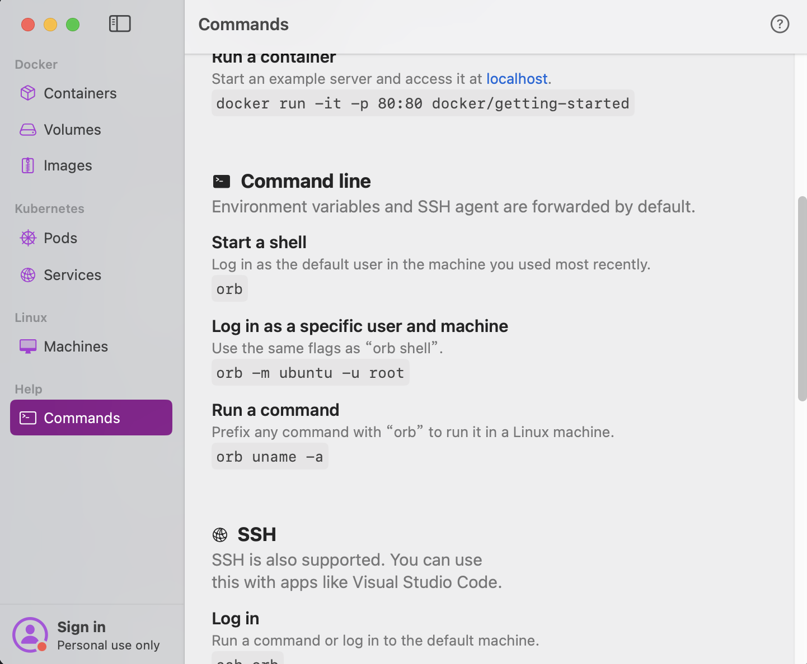
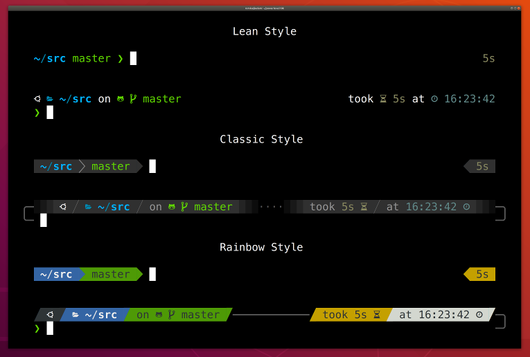
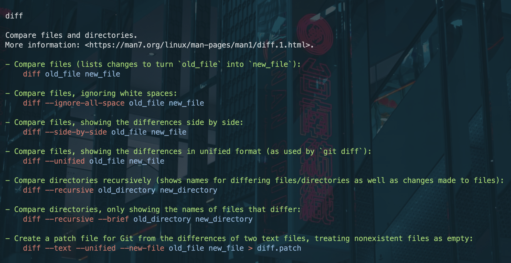
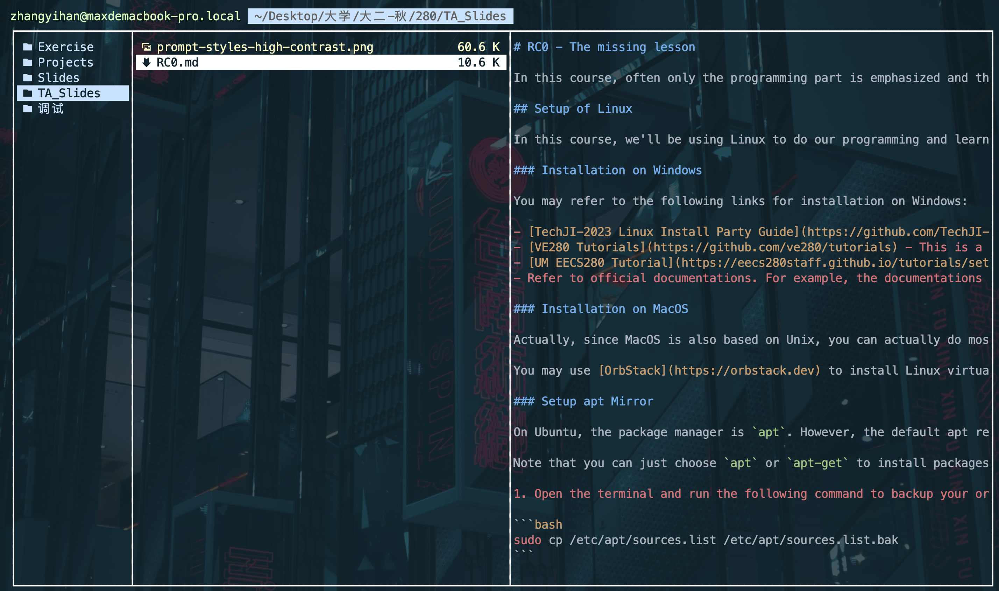
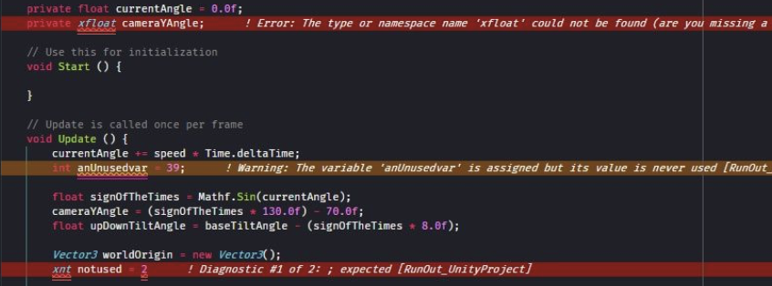

# VE280 2024SP RC0 - The missing lesson

In this course, often only the programming part is emphasized and the basic setup of our environment is neglected. For beginners, they'll feel as if they're missing something. This recitation class is meant to fill that gap. The tools we set up here will be used throughout the course and even in the future.

## Setup of Linux

In this course, we'll be using Linux to do our programming and learning. Don't worry, Linux is not as difficult as you think. Here I'll provide some tutorials for you to install Linux on your computer.

### Installation on Windows

You may refer to the following links for installation on Windows:

<!-- - [TechJI-2023 Linux Install Party Guide](https://github.com/TechJI-2023/Linux-Install-Party) - This guide was written by the Tech apartment in Fall 2023. It's not very detailed, but it can still be helpful.
- [VE280 Tutorials](https://github.com/ve280/tutorials) - This is a tutorial contributed by previous students. It's a bit outdated due to numerous Ubuntu version updates, but it can still be helpful.
- [UM EECS280 Tutorial](https://eecs280staff.github.io/tutorials/setup_wsl.html) - This is a tutorial written by the EECS280 staff at the University of Michigan. It's very detailed and the whole set of tutorials is very helpful. I recommend you to read through all of them concerning the topics of environment setup.
- Refer to official documentations. For example, the documentations of wsl and Ubuntu. -->
- <a href="https://github.com/TechJI-2023/Linux-Install-Party" style="text-decoration: underline;">TechJI-2023 Linux Install Party Guide</a> - This guide was written by the Tech apartment in Fall 2023. It's not very detailed, but it can still be helpful.
- <a href="https://github.com/ve280/tutorials" style="text-decoration: underline;">VE280 Tutorials</a> - This is a tutorial contributed by previous students. It's a bit outdated due to numerous Ubuntu version updates, but it can still be helpful.
- <a href="https://eecs280staff.github.io/tutorials/setup_wsl.html" style="text-decoration: underline;">UM EECS280 Tutorial</a> - This is a tutorial written by the EECS280 staff at the University of Michigan. It's very detailed and the whole set of tutorials is very helpful. I recommend you to read through all of them concerning the topics of environment setup.
- Refer to official documentations. For example, the documentations of wsl and Ubuntu.

### Installation on MacOS

Actually, since MacOS is also based on Unix, you can actually do most of your programming on MacOS. However, there are still some inconveniences. For example, you can't use `valgrind`, a memory leak checking tool, on MacOS. Therefore, I recommend you to install Linux on your Mac.

<!-- You may use [OrbStack](https://orbstack.dev) to install Linux virtual machines on your Mac. Just follow the instructions in the software, it is quite simple. The following is a screenshot of OrbStack containing the relevant commands to start a Linux virtual machine: -->
You may use <a href="https://orbstack.dev" style="text-decoration: underline;">OrbStack</a> to install Linux virtual machines on your Mac. Just follow the instructions in the software, it is quite simple. The following is a screenshot of OrbStack containing the relevant commands to start a Linux virtual machine:

<!-- markdownlint-disable MD033 -->
<div align = "center">

</div>
<!-- markdownlint-enable MD033 -->

### Setup apt Mirror

On Ubuntu, the package manager is `apt`. However, the default apt repository is very slow in China. You may switch to [tuna mirror](https://mirror.tuna.tsinghua.edu.cn/help/ubuntu/) and follow the following instructions:

Note that you can just choose `apt` or `apt-get` to install packages. They are equivalent.

1. Open the terminal and run the following command to backup your original apt source list.

```bash
sudo cp /etc/apt/sources.list /etc/apt/sources.list.bak
```

2. Open the apt source list with your favorite editor. Here I use `vim`, you may also choose `nano`.

```bash
sudo vim /etc/apt/sources.list
```

<!-- 3. Paste the content on [tuna mirror](https://mirror.tuna.tsinghua.edu.cn/help/ubuntu/) to the file and save it. Then run the following command to update the apt source list. -->
3. Paste the content on <a href = "https://mirror.tuna.tsinghua.edu.cn/help/ubuntu/" style = "text-decoration: underline;">tuna mirror</a> to the file and save it. Then run the following command to update the apt source list.

```bash
sudo apt update
```

#### Cautions

- Pay attention to the mirror to use. Choose the right version **based on your CPU framework**, i.e. whether it's `x86` or `arm64` or something else.
- Remember to run `sudo apt update` after you change the apt source list.

### Install development tools

In this course, we'll be using `g++` as our compiler. You may install the relevant tools by running the following command:

```bash
sudo apt install build-essential
```

Also, install `valgrind` for memory leak checking:

```bash
sudo apt install valgrind
```

According to my experience, you won't encounter topics concerning dynamic memory allocation until the second half of the course. Therefore, you may install `valgrind` later.

### Choose a text editor

<!-- Here I recommend you to use **Visual Studio Code** or **Clion**. Personally I use VSCode and I prefer its versatility, as it can also edit markdown files and latex files. Just choose as you like. I suppose you have already set up your text editor in course VG101 or VG151 and won't talk much about this part. [This](https://eecs280staff.github.io/tutorials/setup_vscode.html) is a tutorial for setting up VSCode for C++ programming in case you need it. -->
Here I recommend you to use **Visual Studio Code** or **Clion**. Personally I use VSCode and I prefer its versatility, as it can also edit markdown files and latex files. Just choose as you like. I suppose you have already set up your text editor in course VG101 or VG151 and won't talk much about this part. <a href="https://eecs280staff.github.io/tutorials/setup_vscode.html" style="text-decoration: underline;">This</a> is a tutorial for setting up VSCode for C++ programming in case you need it.

## Additional tools (optional)

Congratulations! You have finished the basic setup of your Linux environment. Theoretically, you can start your programming journey now. However, there are still some tools or tips that can make your life easier.

### Command line environment

#### Zsh Installation

Your default shell is called `bash` and is already very powerful. However, there is another shell called `zsh` which is more powerful and more user-friendly. You may install it by running the following command:

```bash
sudo apt install zsh
```

Note that Mac users already have `zsh` installed by default.

Then you may change your default shell to `zsh` by running the following command:

```bash
chsh -s $(which zsh)
```

Then you may download oh-my-zsh, a powerful configuration framework for `zsh`, by running the following command:

```bash
sudo apt install git # install git first to download oh-my-zsh
sh -c "$(curl -fsSL https://gitee.com/shmhlsy/oh-my-zsh-install.sh/raw/master/install.sh)"
```

Then restart your terminal and you'll see the difference.

#### Zsh plugins

Zsh provides a lot of powerful plugins. Among them, I recommend you to install the following two plugins:

- `zsh-autosuggestions` - This plugin will automatically suggest commands based on your command history. You may use the right arrow key to accept the suggestion. Note that only commands you have already typed will be suggested. This is different from tab completion, but it will still show you the completion result, which is very useful.

- `zsh-syntax-highlighting` - This plugin will highlight your command based on its syntax. If your command is correct, it will be highlighted in green. Otherwise, it will be highlighted in red. For example, `touch main.cpp` will be highlighted in green, while `touchh main.cpp` will be highlighted in red.

You may install them by running the following commands:

```bash
# zsh-autosuggestions
git clone https://gitee.com/kanderWall/zsh-autosuggestions.git ${ZSH_CUSTOM:-~/.oh-my-zsh/custom}/plugins/zsh-autosuggestions
# zsh-syntax-highlighting
git clone https://gitee.com/Annihilater/zsh-syntax-highlighting.git ${ZSH_CUSTOM:-~/.oh-my-zsh/custom}/plugins/zsh-syntax-highlighting
```

Then open your `~/.zshrc` file and modify the following part:

```bash
plugins=(
    ...
)
```

to

```bash
plugins=(
    ...
    zsh-autosuggestions
    zsh-syntax-highlighting
    ...
)
```

Then restart your terminal and you'll see the difference. Or you can run `source ~/.zshrc` to reload the configuration. By the way, I have the alias of `source ~/.zshrc` as `reload` in my `~/.zshrc` file.

Apart from these two plugins, you may also install other plugins as you like. For example, I also installed `z` and `fzf`.

`z` is a plugin that can help you jump to a directory quickly. For example, if you have a directory called `~/Documents/VE280`, you may jump to it by running `z VE280` or even just `280`. Note that you need to cd to the directory at least once before you can jump to it.

<!-- `fzf` is a fuzzy finder. It can help you find files or directories quickly. For example, if you want to find a file called `main.cpp` in the current directory, you may run `fzf` and type `main.cpp`. It will show you all the files that contain `main.cpp` in their names. Then you may choose the file you want to open and the path of the file will be displayed. You may view the detailed usage of `fzf` [by the official github page](https://github.com/junegunn/fzf) or [by this video](https://www.bilibili.com/video/BV1bJ411s74r/?spm_id_from=333.999.0.0&vd_source=74ce1ab72a13dc658c375d2f17941595). -->
`fzf` is a fuzzy finder. It can help you find files or directories quickly. For example, if you want to find a file called `main.cpp` in the current directory, you may run `fzf` and type `main.cpp`. It will show you all the files that contain `main.cpp` in their names. Then you may choose the file you want to open and the path of the file will be displayed. You may view the detailed usage of `fzf` <a href="https://github.com/junegunn/fzf" style="text-decoration: underline;">by the official github page</a> or <a href="https://www.bilibili.com/video/BV1bJ411s74r/?spm_id_from=333.999.0.0&vd_source=74ce1ab72a13dc658c375d2f17941595" style="text-decoration: underline;">by this video</a>.

To install `z`, just add `z` to the `plugins` part in `~/.zshrc`:

```bash
plugins=(
    ...
    z
    ...
)
```

To install `fzf`, run the following command:

```bash
sudo apt install fzf
```

#### Zsh themes

<!-- You can customize your zsh theme as well. I'm currently using `powerlevel10k`. You may refer to [the official github page](https://github.com/romkatv/powerlevel10k) or other tutorials for more information. Remember to install the font `MesloLGS NF` or other nerd fonts as well to show the icons correctly. -->
You can customize your zsh theme as well. I'm currently using `powerlevel10k`. You may refer to <a href="https://github.com/romkatv/powerlevel10k" style="text-decoration: underline;"> the official github page</a> or other tutorials for more information. Remember to install the font `MesloLGS NF` or other nerd fonts as well to show the icons correctly.

The theme looks like this and you can customize it by running `p10k configure`:

<!-- markdownlint-disable MD033 -->
<div align = "center">

</div>
<!-- markdownlint-enable MD033 -->

#### Other plugins

#### tldr - a better man page

After installing so much plugins, you may consult `man` pages to learn more about them. But I recommend you to use `tldr` instead. This is a tool that provides simplified `man` pages. You may install it by running the following command:

```bash
sudo apt install tldr
```

But you need to manually update the `tldr` pages when you install it for the first time. You may run the following command to update the `tldr` pages: 

```bash
tldr --update # or
tldr -u
```

It is likely you see the following error message:

```bash
tldr: /root/.local/share/tldr: createDirectory: does not exist (No such file or directory)
```

You may solve this problem by running the following command:

```bash
sudo mkdir -p /root/.local/share/tldr
tldr --update
```

Then you may try if `tldr` works by running `tldr diff` or other commands. It may look like this:

<!-- markdownlint-disable MD033 -->
<div align="center">
    
</div>
<!-- markdownlint-enable MD033 -->

#### File manager

I also recommend you to install a file manager. From my routine use, it's more convenient to use a file manager than to use `cd` and `ls` or GUI. The most popular file manager is `ranger` and I'm currently using `joshuto`, a `ranger` like file manager written in rust. The installation of `ranger` is quite simple:

```bash
sudo apt install ranger
```

Then you can run `ranger` to open it. <!-- markdownlint-disable MD033 -->You may refer to <a href="https://github.com/ranger/ranger" style="text-decoration: underline;">the official github page</a> or <a href="https://www.bilibili.com/video/BV1b4411R7ck/?spm_id_from=333.999.0.0&vd_source=74ce1ab72a13dc658c375d2f17941595" style="text-decoration: underline;">this video</a>.<!-- markdownlint-enable MD033 --> For more detailed information. I recommend you watch the video because it's more detailed and easy to understand than the official documentation.

The file manager looks like this:

<!-- markdownlint-disable MD033 -->
<div align="center">
    
</div>
<!-- markdownlint-enable MD033 -->

#### Vim or Vim keybindings

In this tutorial, you may notice that I prefer to use `vim` to edit files. Actually, with modern text editors like VSCode, you don't need to use `vim` to edit files. However, I still recommend you to learn `vim` keybindings because it is so powerful and efficient. It is the only editor that can match the speed at which you think. <a href="https://missing.csail.mit.edu/2020/editors/" style="text-decoration: underline;">This tutorial</a> contains most of vim's usages. For the basic keybindings, you may run `vimtutor` in your shell as the following to learn them.

```bash
vimtutor
```

Vim keybindings is widely used. You may install the `vim` plugin in VSCode to enable vim keybindings. Also, files managers like `ranger` support vim keybindings as well. And when you edit files in shell, like `~/.zshrc`, using vim to edit is more efficient than other editors like `nano`.

Also, you may install more advanced versions of `vim` like `neovim`. I'm currently using `lunarvim`, and <!-- markdownlint-disable MD033 -->you may refer to the <a href="https://www.lunarvim.org/docs/installation" style="text-decoration: underline;">official documentation</a> for more information.
<!-- markdownlint-enable MD033 -->

### VSCode plugins

Since I'm using VSCode, I also recommend you to install some plugins for VSCode to make your life easier. I'll assume you have already installed basic plugins like `C/C++` and `Code Runner`.

- `Better Comments` - This plugin can help your comment stand out and more readable.
- `Todo Tree` - This plugin can help you manage your TODOs and serves as bookmarks.
- `Trailing Spaces` - This plugin can mark the trailing spaces in your code as red. This is especially useful when you are comparing two files.
- `Partial Diff` - This plugin can help you compare two text blocks. You may select two files and right click to compare them. From my experience, this is better than the `diff` command.
- `Error Lens` - This plugin can highlight the error in your code and show you the error message on the same line. A screenshot is shown below:

<!-- markdownlint-disable MD033 -->
<div align="center">
    
</div>
<!-- markdownlint-enable MD033 -->

- `Reload` - Add a reload button to the status bar. You may click it to reload the window conveniently.
- `Vim` - This plugin enables vim keybindings in VSCode. It combines the functionality of VSCode and efficiency of vim.
- `JOJ Tools` - This plugin helps you submit your code to JOJ by one click instead of repeatedly zipping and uploading your files.
- `Github Copilot` - **The most powerful** plugin I've ever seen. Just activate your github account and verify your identity as a student and you'll be given access to use it free. You may refer to <a href="https://zhuanlan.zhihu.com/p/618772237" style="text-decoration: underline;">this link</a> or other tutorials on zhihu for more details. Once you're approved, you'll receive an email from Github after about 3 days. Copilot is also available in other IDEs like JetBrains IDEs and neovim. **But make sure to check the correctness of code produced by copilot**.

## Reminder on code style

A brief reminder on code style:

- Name variables and functions which can be understood by others.
- Write good comments.
- Ensure indentation is correct.
- Ensure consistency in naming style of variables and functions.
- Don't pile too much arguments and lines in one function.
- If you don't know how to name variables, you can consult <a href="https://unbug.github.io/codelf/" style="text-decoration: underline;">Codelf</a> for more names.

You may also refer to the lecture slides for these rules.

In VSCode, you may right click and choose `Format Document` to format your code. Also, the default keybinding for formatting is `Shift + Alt + f`.

<!-- markdownlint-disable MD033 -->
To learn better coding style, you may refer to <a href = "https://eecs280staff.github.io/tutorials/style_guide.html" style = "text-decoration: underline;">this tutorial</a> for good habits or <a href = "https://github.com/trekhleb/state-of-the-art-shitcode" style = "text-decoration: underline;">this page</a> for bad habits that you should avoid. It's also worth noting that the coding style of ChatGPT is good.
<!-- markdownlint-enable MD033 -->

## More References

I took references from the below articles and tutorials. If you're interested or want to learn more about how to set up your developing environment, please refer to the following links.

<!-- markdownlint-disable MD033 -->
1. <a href="https://missing.csail.mit.edu" style="text-decoration: underline;">MIT missing semester of your CS education</a>
2. <a href="https://github.com/PKUFlyingPig/cs-self-learning" style="text-decoration: underline;">CS self learning materials</a>. You may focus on <a href="https://github.com/PKUFlyingPig/cs-self-learning/blob/master/docs/CS学习规划.md" style="text-decoration: underline;">this file</a>.
3. <a href="https://eecs280staff.github.io/tutorials/" style="text-decoration: underline;">UM EECS280 tutorials</a>
4. ChatGPT
5. Github
6. Platforms like stackoverflow. Be skeptical when viewing articles on CSDN.
