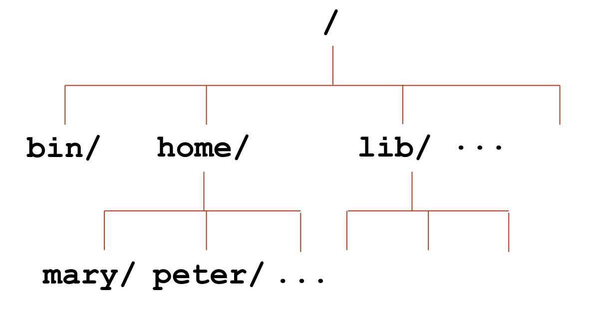
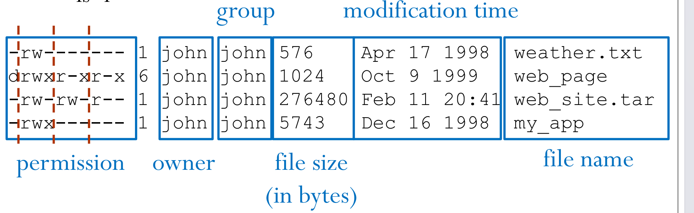

# VE280 2024SP RC1

## Prerequisites

I assume that you have already setup the following environment:

- A working Linux environment (either a VM or a physical machine)
- A working C++ compiler on your Linux or MacOS system

If you haven't done so, please refer to my RC0 for more details.

## Intro to Linux

### File System

In Linux, everything is a file. The file system is a tree structure. The following figure gives a brief demonstration of the file system.

<!-- markdownlint-disable MD033 -->
<p align="center">
  
</p>
<!-- markdownlint-enable MD033 -->

Key points:

- `/` is the root directory
- `.` is the current directory
- `..` is the parent directory
- `~` is the home directory

### Command Line Interface

In linux (and MacOS), we can use **C**ommand **L**ine **I**nterface to interact with a computer. It is fast, easy to automate and easy to use remotely. By default your terminal has a shell named `bash`.

The general syntax of a command is:

```bash
command [options] [arguments] # or
command arg1 arg2 ...
```

#### Basic Commands

- `man <command>`: read the manual of a command
  - this command can be replaced by `tldr` in most cases, which I introduced in RC0
- `pwd`: print working directory
- `ls`: list files and directories
  - `ls -a`: list all files and directories including hidden ones
  - `ls -l`: list files and directories in long format
  - `ls -al`: list all files and directories in long format

Pay attention to the long format of `ls`:

- The first character indicates the type of the file
  - `-`: regular file
  - `d`: directory
- The next 9 characters indicate the permissions of the file
  - `r`: read
  - `w`: write
  - `x`: execute
  - The first three characters indicate the permissions of the owner
  - The second three characters are for the group
  - The last three characters are for others

<!-- markdownlint-disable MD033 -->
<p align="center">
  
</p>
<!-- markdownlint-enable-MD033 -->

- `cd`: change directory
  - `cd <path>`: change to the directory specified by `<path>`
  - `cd ..`: change to the parent directory
  - `cd ~`: change to the home directory
- `mkdir <directory>`: make a new directory specified by `<directory>`
- `rmdir <directory>`: remove an empty directory specified by `<directory>`
- `touch <file>`: create an empty file specified by `<file>`
- `rm <file>`: remove a file or directory specified by `<file>`
  - `rm -r <file>`: remove a directory recursively
  **Necessary for removing non-empty folders**
  - `rm -i <file>`: ask for confirmation before removing a file or directory
  - `rm -f <file>`: force remove a file or directory
  **This can be dangerous**
- `cp <source> <destination>`: copy a file or directory from `<source>` to `<destination>`
  - `cp -r <source> <destination>`: copy a directory recursively
  **Necessary for copying non-empty folders**
- `mv`: move a file or directory or rename a file
  - `mv <file1> <file2>`: rename a file or directory from `<file1>` to `<file2>`
  - `mv <file> <directory>`: move a file or directory to a directory
  - `mv <directory> <directory>`: move a directory to another directory
- `cat <file>`: print the content of a file
  - There's a modern version of `cat` called `bat`

#### Advanced Commands

These commands are necessary as well and you may encounter them in exams.

- `less <file>`: view a file with a read-only mode
  - `less` is a pager, which means it only loads a part of the file at a time
  - quit `less` by pressing `q`
  - supports `vim` key bindings, which I introduced in RC0
  **It's really useful to learn `vim` key bindings**
